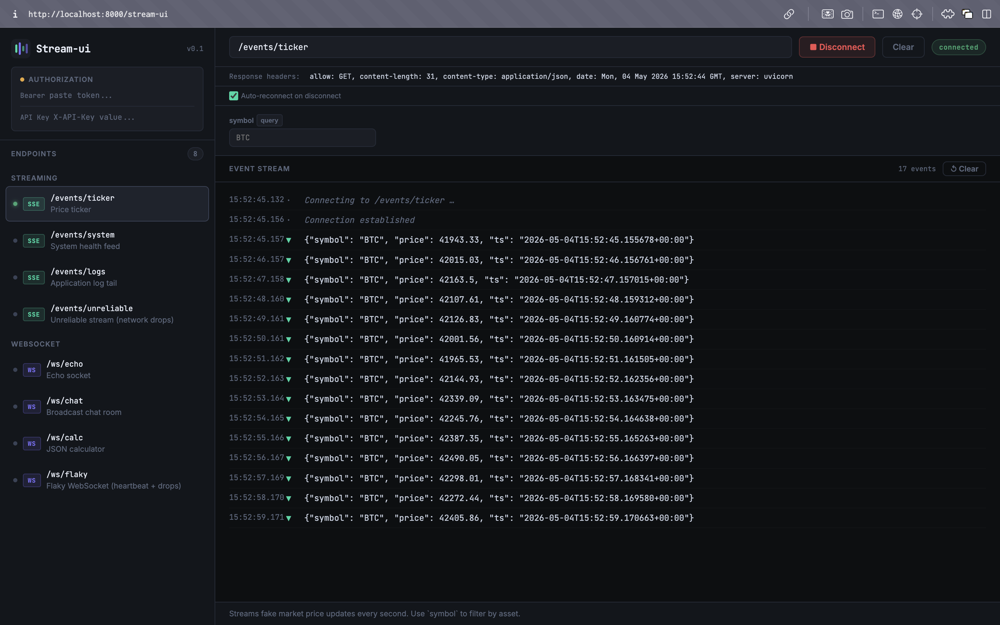
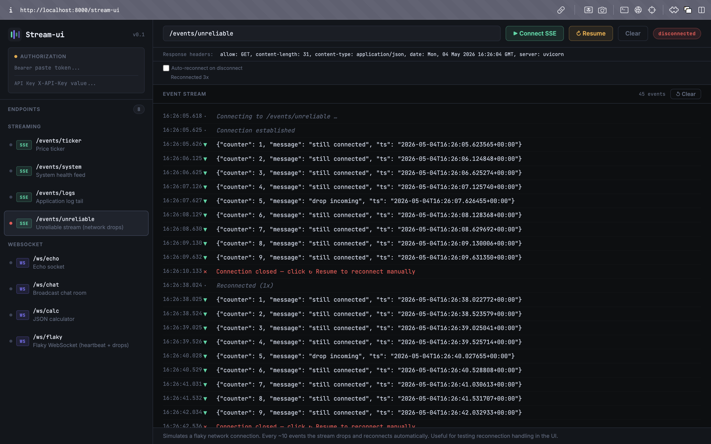
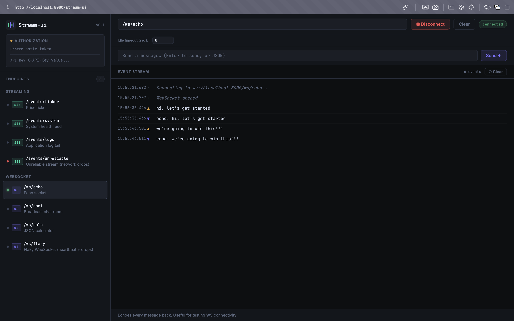
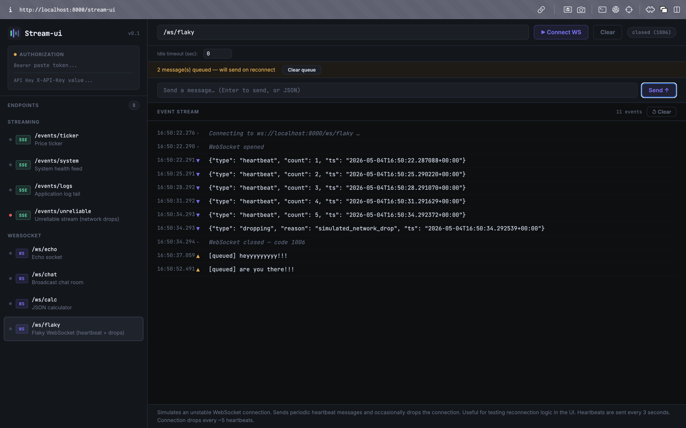

# stream-ui

**Interactive streaming API explorer for FastAPI** — built for SSE and WebSocket endpoints.

Stream-ui mounts directly into your FastAPI app (just like `/docs` or `/redoc`) and gives you a live UI to connect, test, and watch streaming endpoints in real time.

```
pip install stream-ui
```

---

## Quickstart

```python
from fastapi import FastAPI
from stream_ui import StreamUI, sse_endpoint, ws_endpoint

app = FastAPI()

@app.get("/events")
@sse_endpoint(summary="Live event feed", tags=["Streaming"])
async def events():
    ...

@app.websocket("/ws/chat")
@ws_endpoint(summary="Chat socket", tags=["Streaming"], path="/ws/chat")
async def chat(websocket): ...

StreamUI(app).mount()
# → http://localhost:8000/stream-ui
```

---

## Screenshots

### Server-Sent Events (SSE)

*Real-time event streaming with automatic reconnects and parameter support.*

### Manual Resume

*Toggle auto-reconnect or manually resume dropped streams.*

### WebSockets

*Interactive WebSocket sessions with a persistent message history.*

### Message Queueing

*Queue messages while disconnected; they are sent automatically upon reconnection.*

---

## Decorators

### `@sse_endpoint(...)`

Marks a route as a Server-Sent Events endpoint for Stream-ui discovery.

```python
@app.get("/stream/prices")
@sse_endpoint(
    summary="Price ticker",
    description="Streams live market prices.",
    tags=["Market"],
    params=[
        {
            "name": "symbol",
            "in": "query",
            "description": "Asset symbol to track",
            "required": False,
            "default": "BTC",
            "type": "string",
        }
    ],
)
async def prices(symbol: str = "BTC"):
    async def gen():
        while True:
            yield f"data: {symbol}:{get_price()}\n\n"
            await asyncio.sleep(1)
    return StreamingResponse(gen(), media_type="text/event-stream")
```

### `@ws_endpoint(...)`

Marks a WebSocket route for Stream-ui discovery.

```python
@app.websocket("/ws/echo")
@ws_endpoint(
    summary="Echo socket",
    description="Echoes every message back.",
    tags=["Sockets"],
    path="/ws/echo",   # required — WS routes aren't in OpenAPI
)
async def echo(websocket: WebSocket):
    await websocket.accept()
    while True:
        msg = await websocket.receive_text()
        await websocket.send_text(f"echo: {msg}")
```

### Decorator parameters

| Parameter     | Type            | Description                                                |
|---------------|-----------------|------------------------------------------------------------|
| `summary`     | `str`           | Short label shown in the sidebar                           |
| `description` | `str`           | Longer description shown below the toolbar (markdown ok)  |
| `tags`        | `list[str]`     | Grouping tags (same convention as FastAPI)                 |
| `path`        | `str \| None`   | Override the route path (required for WS routes)          |
| `params`      | `list[dict]`    | Extra param hints (see below)                             |

#### Param dict shape

```python
{
    "name": "symbol",          # field name
    "in": "query",             # "query" | "path"
    "description": "...",      # tooltip / placeholder
    "required": False,
    "default": "BTC",
    "type": "string",          # for future type-aware inputs
}
```

> **Note:** For SSE routes, Stream-ui also auto-reads params from the OpenAPI schema — `params=` is for adding hints that FastAPI can't infer (e.g. dynamic query params), or for overriding descriptions.

---

## Stacking decorators

Decorators are **order-independent** and **non-interfering**. Both of these work:

```python
# @sse_endpoint above @app.get
@sse_endpoint(summary="Feed")
@app.get("/feed")
async def feed(): ...

# @sse_endpoint below @app.get  (more idiomatic)
@app.get("/feed")
@sse_endpoint(summary="Feed")
async def feed(): ...
```

Stream-ui walks the `__wrapped__` chain so the metadata is found regardless of position.

---

## Auth

Stream-ui handles auth the same way Swagger UI does — you provide credentials once in the sidebar, and they are injected into every connection.

**Bearer token:**  Injected as `Authorization: Bearer <token>` (HTTP header for SSE, query param `_token` as fallback, included in WS URL query string).

**API key:** Optional `X-API-Key` header field (enable with `enable_api_key=True`).

```python
StreamUI(
    app,
    default_token="dev-secret-token",  # pre-fills the auth panel
    enable_api_key=True,
).mount()
```

On the server side, check both header and fallback query param:

```python
def get_token(
    authorization: str | None = Header(default=None),
    _token: str | None = Query(default=None),
):
    if authorization:
        return authorization.removeprefix("Bearer ").strip()
    return _token
```

---

## `StreamUI` options

```python
StreamUI(
    app,
    path="/stream-ui",        # URL prefix (default: "/stream-ui")
    title="Stream-ui",        # Browser tab title
    default_token=None,       # Pre-fill bearer token field
    enable_api_key=True,      # Show API key field in auth panel
).mount()
```

---

## Run the example

```bash
git clone https://github.com/felixLandlord/stream-ui
cd stream-ui
uv sync

# macOS / Linux
source .venv/bin/activate

# Windows (PowerShell)
.venv\Scripts\Activate.ps1

uvicorn example.app:app --reload
```

Open **http://localhost:8000/stream-ui** — you'll find:

| Endpoint             | Kind | Description                        |
|----------------------|------|------------------------------------|
| `/events/ticker`     | SSE  | Fake price feed (try `symbol=ETH`) |
| `/events/system`     | SSE  | Named events: cpu / memory / disk  |
| `/events/logs`       | SSE  | Log tail with level filter         |
| `/ws/echo`           | WS   | Echo socket                        |
| `/ws/chat`           | WS   | Multi-client broadcast chat        |
| `/ws/calc`           | WS   | JSON calculator                    |

---

## Run the tests

```bash
pytest tests/ -v
```

---

## How it works

Stream-ui uses the same mounting mechanism as FastAPI's built-in `/docs`:

1. `mount_stream_ui(app)` registers two routes: `GET /stream-ui` (the UI) and `GET /stream-ui/_endpoints` (the discovery API).
2. The UI is a **single self-contained HTML page** — inline CSS + JS, zero external runtime dependencies.
3. On load, the UI calls `/_endpoints` to fetch all annotated routes.
4. For SSE: the browser opens a native `EventSource` to your endpoint and streams events live into the UI.
5. For WS: the browser opens a `WebSocket`, shows incoming messages, and lets you send messages interactively.
6. Auth tokens are injected client-side — Stream-ui never proxies your traffic.

---

## Distribution

```bash
pip install build
python -m build
# → dist/stream-ui-0.1.0.tar.gz
# → dist/stream-ui-0.1.0-py3-none-any.whl
```

Publish to PyPI:
```bash
pip install twine
twine upload dist/*
```

---

## License

Apache License 2.0